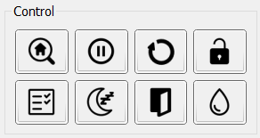

# Panel "Control"

The **Control** panel contains a set of buttons that send basic GRBL commands.
Table lists the button, the command it sends (command code), and its description in the order they appear on the panel – left to right, top to bottom.

**Control Panel Buttons**

| Button | Command | Description |
|--------|---------|-------------|
| **Home** | `$H` | Search for the home position. |
| **Hold** | `!` or `~` | Stop current motion (`!`) or resume movement (`~`). |
| **Reset** | `0x18` | Software reset of the controller. |
| **Unlock** | `$X` | Force unlock from alarm state. |
| **Check** | `$C` or `0x18` | Enable (`$C`) / disable (`0x18`) CP check mode. |
| **Sleep** | `$SLP` | Put the controller into low‑power mode. |
| **Door** | `0x84` | Force the controller into door‑triggered mode. |
| **Flood** | `0xA0` | Toggle water cooling system on/off. |

> Note: When disabling CP check mode, a software reset command is sent followed by restoration of the controller state and work‑coordinate offsets.