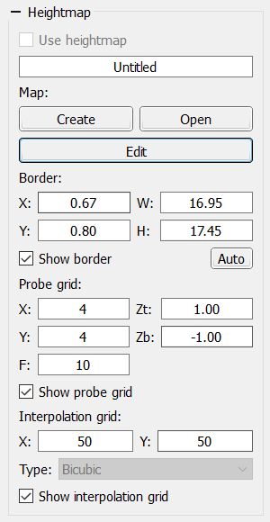

# Panel "Heightmap"

The **Heightmap** panel is responsible for creating, loading, scanning a surface roughness map and subsequently correcting the CP to level the part’s curvature when machining with a CNC.  
This feature is useful for PCB milling and engraving.

The panel provides controls to:

- Create, load and enable the height‑map mode.
- Define a rectangular map area.
- Set the number of probe points along **X** and **Y** axes.
- Set the heightmap origin.
- Specify the working height above the surface and probing depth.
- Set feed rate.
- Choose grid line count for CP partitioning on **X** and **Y**.

CP correction based on the active height map is performed by enabling the **Use heightmap** checkbox.

More detailed information on using the height‑map feature can be found in [Creating a heightmap](qthelp://candle.en/html/process/creatingheightmap.html) of this manual.