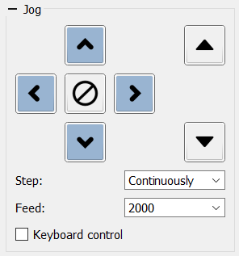

# Panel "Jog"

The **Jog** panel contains controls for moving the CNC tool:

- Arrow buttons for axes **X** (left/right), **Y** (up/down) and **Z** (up/down on the right side).
- A central **Stop** button that force‑stops motion.
- A drop‑down list **Step**, where you can set the jog step size.
- A drop‑down list **Feed**, selecting the jog feed rate.
- A checkbox **Keyboard Control** to enable keyboard jogging from the PC.

The *Step* and *Feed* lists provide predefined values but allow entry of arbitrary numbers.  
Values entered right before **Keyboard Control** is enabled are remembered and can be reused on subsequent program launches.

Each button, as well as changing the *Step* and *Feed* values, may have hotkeys defined in the program’s **Settings** window.
Keyboard control must be turned on for these shortcuts to work.