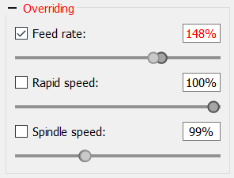

# Panel "Overriding"

Figure shows the **Overriding** panel.  
It contains controls similar to those on the spindle panel but overrides feed rate, idle speed and spindle speed during CP transmission.

The only difference is that the spindle button has been replaced by a corresponding checkbox.