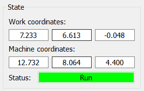

# Panel "State"

The **State** panel displays the current work‑ and machine‑coordinates, as well as the operating mode of the CNC controller.  
Coordinates are shown in output fields arranged horizontally in the order: **X, Y, Z**.

#### Controller operating modes (field *"Status"*)

| Mode | Description |
|------|-------------|
| **Idle** | The controller is ready to receive commands. |
| **Alarm** | An emergency state. |
| **Run** | Executing a control program (CP). |
| **Home** | Searching for the home position. |
| **Hold**  | Motion is paused, awaiting further continue/reset commands. |
| **Check**  | Incoming G‑code is interpreted without actual tool movement. |
| **Door**  | Door‑sensor triggered mode. |
| **Jog**  | Executing special jogging commands. |
| **Sleep** | Low‑power standby mode. |

In the same field, states that are not related to the controller’s operating mode are shown:

- **Not connected** – when the serial port cannot be opened for the CNC.
- **Port opened** – the serial port is open, but no communication with the GRBL controller has been established.

The background color of the *Status* field may change depending on the state.