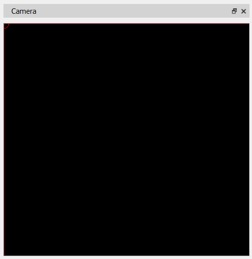

# Window "Camera"

The image from the camera connected to the PC is displayed in the **"Camera"** window.

View navigation inside the window is performed by holding the left mouse button (LMB) and moving the cursor in the desired direction; zooming is controlled with the mouse wheel.

The window contains reticle elements: a vertical line, a horizontal line, and a circle whose centre lies at the intersection of the two lines. The intersection point can be moved by pressing LMB while holding the **Shift** key on the keyboard and dragging the cursor in the desired direction.

Parameters such as camera image resolution, color and thickness of the reticle elements are available in the program’s settings window.