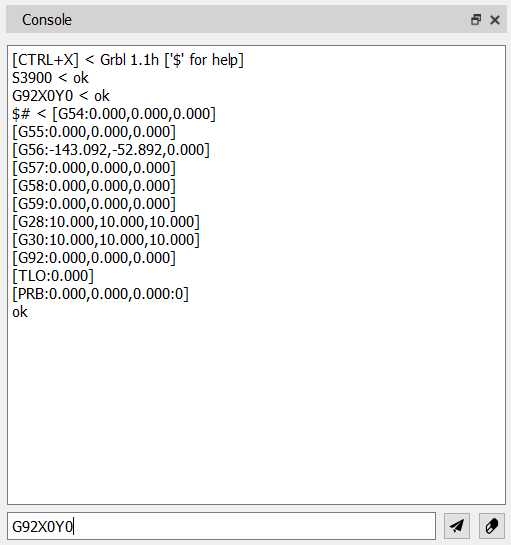

# Window "Console"

For manual CNC control, as well as for configuring and displaying controller status information, the **"Console"** window is provided.

At the bottom of the window there is a command‑entry field and two buttons: **Send Command** and **Clear Console**. At the top a multiline output area shows replies from the controller.

To send a command to the CNC controller, type it into the entry field and press the **Enter** key or click **Send Command**. After the controller processes the command, the command and its reply are displayed above in the following format:

<strong>Command &lt; Response</strong>

If the program setting *"Show UI commands"* is enabled, all commands sent to the controller by toolbar controls will appear in the output area. When *"Show G‑code program commands"* is turned on, every command from the CP that is transmitted to the controller will also be shown.

The output field can be cleared by clicking **Clear Console**.