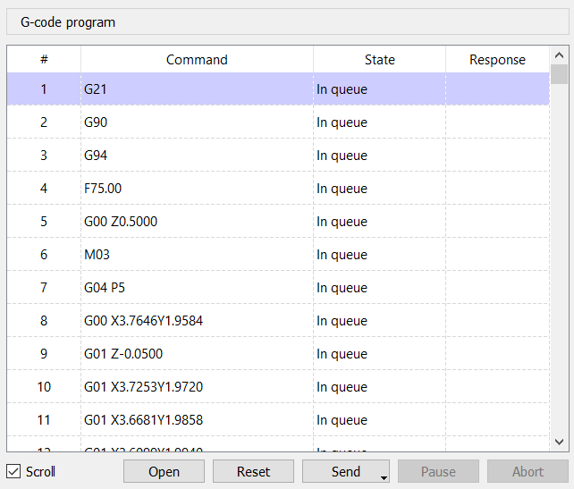

# Window "G-code program"

The current CP is displayed in the **"G‑code program"** window shown in figure:

Each row of the table corresponds to a line of the CP and contains the following columns:

* **"#"** – CP line number.  
* **"Command"** – The command itself.  
* **"State"** – Current state of the command: "In queue", "Sent", "Processed", or "Skipped".  
* **"Response"** – Response from the GRBL controller to the sent command.

The CP can be edited; the following functions are supported:

| Function | How it works |
|----------|--------------|
| Change a command in a selected row | Double‑click the cell in the *Command* column or press `<F2>` while the cell is highlighted. Confirm with `<Enter>` or `<Tab>`, cancel with `<Esc>`. |
| Add new rows | Select the row before which the new one should be inserted, then choose **"Insert line"** from the context menu (right‑click in the table) or press the `<Ins>` key. |
| Delete selected rows | Use **"Delete lines"** from the context menu or press `<Del>`. |

Below the table are controls for loading and sending CP to the CNC controller:

| Button   | Action |
|----------|--------|
| **Open** | Opens a file‑selection dialog; upon confirmation, loads the chosen CP. |
| **Reset** | Clears all selections in the table, sets the first line as current, and resets command states. |
| **Send**  | Starts the transmission of the CP to the CNC controller. |
| **Pause** | Pauses the transmission process. |
| **Stop**  | Stops the transmission. |

> **Note** – When "Pause" or "Stop" is activated, the actual CNC halt occurs only after the controller’s command input buffer has been emptied. For an immediate stop use the **"Hold"** and **"Reset"** commands from the *Control* panel.

There is a **"Scroll"** checkbox to the left of these buttons that enables automatic scrolling of the table during CP transmission. If the CP is actively being sent while the user manually scrolls, this checkbox resets automatically.