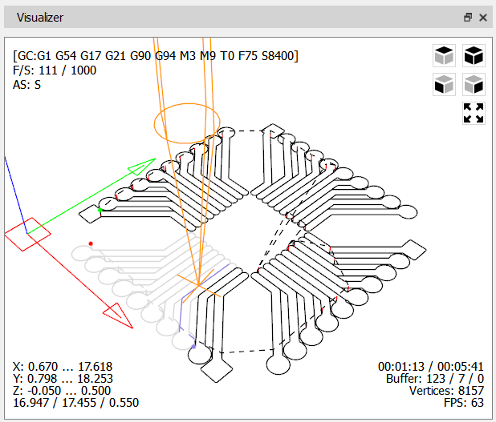

# Window "Visualizer"

The graphical representation of the CP is displayed in the window **"Visualizer"**.

In this window five functional areas can be identified:

- **Central or main area**, where the CP tool trajectory is rendered as a three‑dimensional (3D) projection.  
- **Controller status** in the upper‑left corner.  
- **View‑control buttons** in the upper‑right corner.  
- **Processing limits information** in the lower‑left corner.  
- **Auxiliary information** in the lower‑right corner.

The CP tool trajectory is represented by a set of line segments:

- Solid black lines denote portions of linear and circular interpolation.  
- Dashed black lines indicate accelerated moves.  
- Red lines represent vertical movements.

When the CP is sent to the CNC controller, some segments change color according to the following rules: the part already processed by the CNC is colored grey; the portion that has been transmitted to the CNC is colored violet.

Three circle markers are overlaid on the trajectory:

- **Red marker** – start of the trajectory.  
- **Green marker** – end of the trajectory.  
- **Purple marker** – segment corresponding to the command highlighted in the "G‑code program" window table.

In the main area the origin is shown as a red rectangle in the X–Y plane, with axes colored: X – red, Y – green, Z – blue. A conditional representation of the tool appears as an orange wireframe model.

**Navigation in the main area**

- Rotate the 3D projection by holding the left‑mouse button (LMB) on the main area and moving the cursor, or click one of the view buttons in the upper‑right corner ("Top", "Front", "Left", "Isometric").  
- Move the projection within the area by pressing LMB while holding the `<Shift>` key and dragging.  
- Scale the projection using the mouse wheel or by clicking the **Fit** button in the upper‑right corner.

In the upper‑left corner the current CNC controller state is displayed: the interpreter status string, the current feed and spindle speed values, and the states of CNC components (spindle, cooling system).

The status string has the form:

<strong>[GC:G1 G54 G17 G21 G90 G94 M3 M9 T0 F75 S8000]</strong>

It shows the interpreter’s current mode for all 12 modal groups, tool number, feed rate and spindle speed. The groups and possible modes are listed in table:

| Modal group | Modes |
|-------------|-------|
| **Movement** | G0, G1, G2, G3, G38.2, G38.3, G38.4, G38.5, G80 |
| **Coordinate system** | G54, G55, G56, G57, G58, G59 |
| **Workplane** | G17, G18, G19 |
| **Distance mode** | G90, G91 |
| **IJK circular interpolation** | G91.1 |
| **Feed rate** | G93, G94 |
| **Units of measurement** | G20, G21 |
| **Tool radius compensation** | G40 |
| **Tool length compensation** | G43.1, G49 |
| **Program motion control** | M0, M1, M2, M30 |
| **Spindle state** | M3, M4, M5 |
| **Cooling system state** | M7, M8, M9 |

The CNC component status string appears as:

<strong>AS: SFM</strong>

- **S** indicates spindle rotation clockwise; it is replaced by **C** when rotating counter‑clockwise and omitted when the spindle stops.  
- **F** appears when water cooling is active; **M** denotes air cooling.

The CP processing limits shown in the lower‑left corner list the minimum and maximum coordinates for each axis, as well as the dimensions of the machining zone (excluding tool diameter).

In the lower‑right corner, the current operating time under the loaded CP is displayed, along with an estimated total runtime based on the CP.

Below this area a line presents command‑queue information: the total number of commands sent and currently being processed by the CNC controller; the count of processed commands; and the number of injected commands (commands sent in addition to the CP) present in the queue.

The same section also shows auxiliary data: the total number of vertices forming the 3D projection, and the frames‑per‑second rate at which the projection is being built.