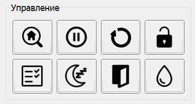

# Панель "Управление"

Панель "Управление" содержит набор кнопок, отвечающих за базовые функции контроллера "GRBL". Состав, посылаемые команды (коды команд), и описание приведены в таблице в порядке их расположения на панели: слева направо, сверху вниз.

| Кнопка        | Команда     | Описание                                                                  |
|---------------|-------------|---------------------------------------------------------------------------|
| Домой         | $H          | Поиск домашнего положения                                                 |
| Удерживание   | ! или ~     | Остановка текущего перемещения (команда !) или возобновление движения (~) |
| Сброс         | 0x18        | Программный сброс контроллера                                             |
| Разблокировка | $X          | Принудительная разблокировка режима аварии                                |
| Проверка      | $C или 0x18 | Включение (команда $C)/выключение (команда 0x18) режима проверки УП       |
| Сон           | $SLP        | Перевод контроллера в режим пониженного энергопотребления                 |
| Дверь         | 0x84        | Принудительный перевод контроллера в режим срабатывания датчика двери     |
| Охлаждение    | 0xA0        | Включение/выключение системы водяного охлаждения                          |

Следует отметить, что при выключении режима проверки УП, посылается команда программного сброса с последующим восстановлением состояния контроллера и смещений рабочих координат.