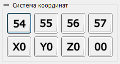

# Панель "Система координат"

На рисунке изображена панель управления системой координат ЧПУ (далее - СК).

На панели расположены кнопки выбора СК и обнуления текущих координат по оси X, Y, Z, всех осей одновременно для активной СК.