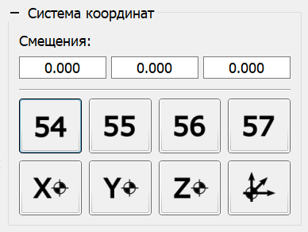

# Панель "Система координат"

На рисунке изображена панель управления системой координат ЧПУ (далее - СК).

В верхней части панели выводятся смещения для активной СК для осей X, Y и Z, в нижней расположены кнопки выбора СК и обнуления текущих координат по оси X, Y, Z, всех осей одновременно для активной СК.