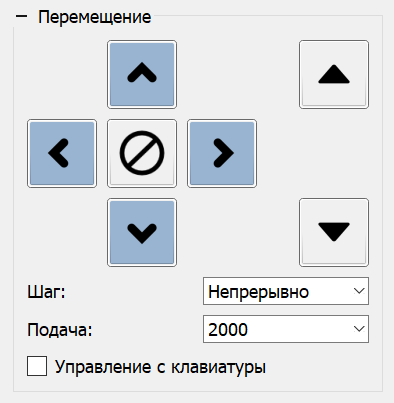

# Панель "Перемещение"

На панели "Перемещение" находятся элементы управления движением инструмента ЧПУ, а именно:

- Кнопки движения по осям X (стрелки влево, вправо), Y (стрелки вверх, вниз), Z (стрелки вверх, вниз, расположенные справа).
- Кнопка "Стоп", расположенная по центру кнопок движения по осям X и Y, отвечающая за принудительную остановку движения.
- Выпадающий список "Шаг", в котором можно задать шаг перемещения.
- Выпадающий список "Подача", отвечающий за выбор скорости перемещения.
- Флаг "Управление с клавиатуры", включающий управление перемещением с клавиатуры ПЭВМ.

Списки "Шаг" и "Подача" имеют предварительные наборы шагов перемещения и скоростей соответственно, но позволяют ввести произвольные значения в поля списков. Введенные значения запоминаются при включении флага "Управление с клавиатуры" и могут выбираться из списков при последующем запуске программы.

Каждой кнопке панели, а также перелистыванию значений "Шаг" и "Подача" могут быть назначены быстрые клавиши, задаваемые в окне "Настройки" программы. Управление данными клавишами включается флагом "Управление с клавиатуры".