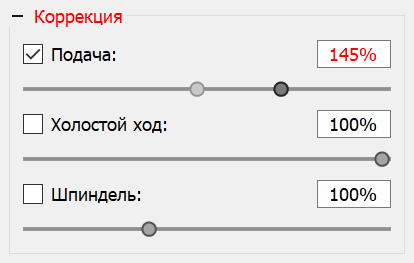

# Панель "Коррекция"

На рисунке представлен вид панели "Коррекция". На панели расположены элементы переопределения скорости подачи, скорости холостого хода и скорости вращения шпинделя во время отправки УП в контроллер ЧПУ.

Элементы аналогичны таковым, расположенным на панели "Шпиндель", за исключением замененной кнопки включения соответствующим флагом.