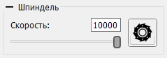

# Панель "Шпиндель"

На панели управления шпинделем расположены:

- Поле ввода для установки/вывода заданной скорости вращения шпинделя.
- Горизонтальный ползунок установки/вывода скорости.
- Кнопка включения/выключения шпинделя.

Скорость вращения может задаваться как вводом числа в соответствующее поле, так и с помощью ползунка.

Текст в поле ввода может иметь два цвета: черный в случае, если текущая скорость вращения шпинделя соответствует заданной; красный - в противном случае.

Ползунок имеет ручку в виде круга серого цвета с контуром темного цвета, с помощью которой задается скорость вращения шпинделя и маркер в виде круга с более светлыми цветами, отображающий текущую скорость вращения.

Во время передачи УП в контроллер скорость вращения может быть изменена с помощью вышеуказанных элементов управления, при этом используются инжектированные G-код команды "S", или с помощью функции переопределения скорости панели "Коррекция". Включение/выключение шпинделя во время передачи возможно только при переводе контроллера в режим удерживания.