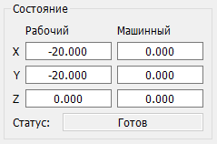

# Панель "Состояние"

На панели "Состояние" выводятся текущие значения рабочих и машинных координат, а также режим работы контроллера ЧПУ. Координаты отображаются в полях вывода, расположенных по горизонтали в порядке: X, Y, Z.

Возможные режимы работы контроллера ЧПУ (поле "Статус") следующие:

- "Готов" - режим готовности к приему команд.
- "Тревога" - режим аварии.
- "Работа" - режим выполнения УП.
- "Дом" - поиск домашней позиции.
- "Удержание" - приостановка движения, ожидание дальнейших команд продолжения/сброса.
- "Проверка" - интерпретация входящих команд без фактического перемещения инструмента.
- "Дверь" - режим срабатывания датчика двери.
- "Перемещение" - режим выполнения специальных команд перемещения.
- "Сон" - режим пониженного энергопотребления.

В этом же поле выводятся состояния, не относящиеся к режиму работы контроллера:

- "Нет соединения" - при невозможности открыть последовательный порт подключения к ЧПУ.
- "Порт открыт" - при открытии последовательного порта, но отсутствии соединения с контроллером ЧПУ. 

Фон поля "Статус" может изменять цвет в зависимости от состояния.