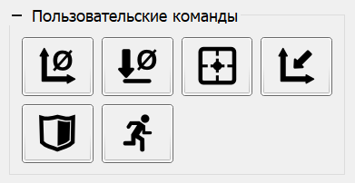

# Панель "Пользовательские команды"

Для расширения функционала программы в части управления ЧПУ предусмотрена панель "Пользовательские команды". На панели расположены кнопки, по нажатию на которые в контроллер ЧПУ отправляются заранее определенные команды.

Задание команд осуществляется в окне "Настройки" программы. В группе "Пользовательские команды" окна имеется таблица команд. В таблице имеется возможность добавить, удалить или переместить команду, а также задать атрибуты:

- Текстовую подсказку, отображаемую над кнопкой панели при наведении на нее курсора мыши.
- Значок кнопки.
- Тип кода команды: набор G-код команд, скрипт.
- Код команды.

Программа содержит ограниченный набор значков для кнопок, набор может расширяться пользовательскими значками нажатием на пункт "..." в конце выпадающего списка.

Код команды может состоять из обычных G-код строк или скрипта.

Подробнее об использовании скриптов в программе читайте в разделе ["Разработка скриптов"](qthelp://candle.ru/html/scripting/index.html) данного руководства.