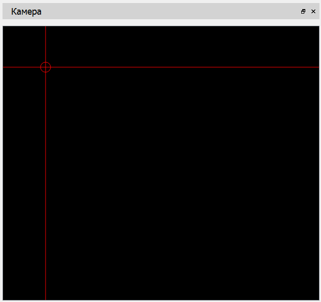

# Окно "Камера"

Изображение с подключенной к ПЭВМ камеры выводится в окне "Камера".

Перемещение вида в окне производится с нажатой ЛКМ смещением курсора мыши в заданном направлении, изменение масштаба - колесом прокрутки мыши.

В окне имеются прицельные элементы: вертикальная, горизонтальная линии и окружность с центром в точке пересечения линий. Перемещение точки пересечения линий производится нажатием ЛКМ с удерживанием клавиши \<Shift\> клавиатуры и перемещением курсора мыши в заданном направлении.

Параметры, такие как: разрешение изображения камеры, цвет и толщина линий прицельных элементов, доступны в окне настроек программы.

Окно "Камера" недоступно в Mac OS X.