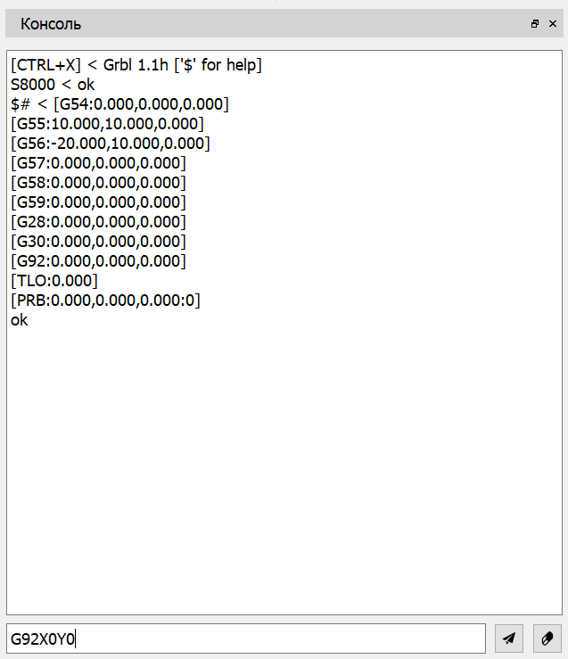

# Окно "Консоль"

Для ручного управления ЧПУ, а также настройки и вывода информации о состоянии контроллера в программе предусмотрено окно "Консоль".

В нижней части окна имеется поле ввода команды и две кнопки: "Отправить команду" и "Очистить консоль". В верхней части расположено многострочное поле вывода ответов от контроллера.

Для отправки команды в контроллер ЧПУ необходимо ввести ее в соответствующее поле и нажать клавишу \<Enter\> клавиатуры или кнопку "Отправить команду". После обработки команды контроллером, команда и ответ будут выведены в поле выше в следующем формате:

<strong>Команда &lt; Ответ</strong>

Если в настройках программы включен флаг "Отображать команды интерфейса пользователя" в поле выводов ответов будут отображены все команды, отправляемые в контроллер по нажатию элементов управления инструментальных панелей. При включенном флаге "Отображать команды G-code программы" - все команды УП при передаче УП в контроллер. 

Очистка поля вывода ответов производится нажатием на кнопку "Очистить консоль".