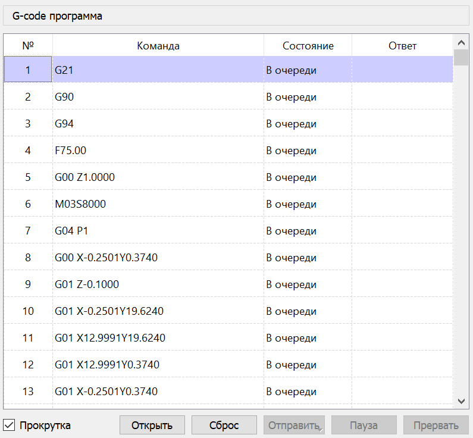

# Окно "G-код программа"

Текущая УП отображается в окне "G-код программа".

Каждая строка УП соответствует строке в таблице, содержащей столбцы:

- "№" - номер строки УП.
- "Команда" - команда УП.
- "Состояние" - текущее состояние команды ("В очереди", "Отправлена", "Обработана", "Пропущена").
- "Ответ" - ответ контроллера на отправленную команду.

УП может быть отредактирована, поддерживаются следующие функции:

- Изменение команды в выбранной строке.
- Добавления новых строк УП.
- Удаление строк УП. 

Вход в режим редактирования команды УП выполняется двойным нажатием ЛКМ в столбце "Команда" выбранной строки или нажатием клавиши \<F2\> в предварительно выбранной ячейке. Подтверждение ввода измененной команды осуществляется нажатием клавиши \<Enter\> или \<Tab\>, отмена - нажатием клавиши \<Esc\>.

Для добавления строки - необходимо выбрать в таблице строку, перед которой вставляется новая строка, и активировать пункт "Вставить строку" контекстного меню, вызываемого нажатием правой кнопки мыши (далее - ПКМ) в области таблицы, или нажать на клавишу \<Ins\> клавиатуры.

Удаление выделенных строк таблицы производится вызовом пункта "Удалить строки" контекстного меню таблицы или нажатием на клавишу \<Del\> клавиатуры.

Под таблицей расположены кнопки управления загрузкой и отправкой УП в контроллер ЧПУ:

- "Открыть" - вызывает диалог выбора файла УП, в случае подтверждения выбора - загружает УП.
- "Сброс" - снимает выделение в таблице, устанавливает первую строку УП текущей, сбрасывает состояние команд.
- "Отправить" - запускает процесс передачи УП в контроллер ЧПУ.
- "Пауза" - приостанавливает процесс передачи УП.
- "Прервать" - останавливает передачу УП.

Следует учитывать, что при активации команд "Пауза" и "Остановить" фактическая остановка ЧПУ выполняется только по опустошению входного буфера команд контроллера. Для немедленной остановки ЧПУ необходимо использовать команды панели "Управление": "Удержание", "Сброс".

Слева от кнопок расположен флаг, отвечающий за автоматическую прокрутку таблицы в процессе отправки УП. При активной передаче УП в контроллер и ручной прокрутке таблицы флаг сбрасывается.