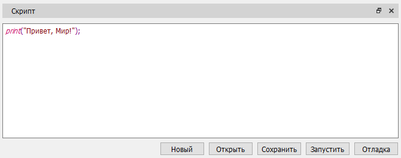

# Окно "Скрипт"

Окно представлено областью редактирования кода скрипта и набором кнопок для:

- Очистки области кода (кнопка "Новый").
- Отрытия файла скрипта.
- Записи скрипта в файл.
- Запуска и отладки скрипта.