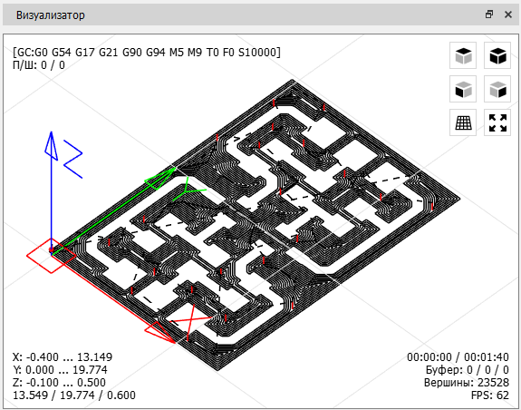

# Окно "Визуализатор"

Графическое представление УП отображается в окне "Визуализатор".

В окне можно выделить пять функциональных областей:

- Центральная или основная область, в которой выводится траектория инструмента УП в виде трехмерной (3D) проекции.
- Состояние контроллера ЧПУ в левом верхнем углу.
- Кнопки управления видом в правом верхнем углу.
- Информация о границах обработки УП в левом нижнем углу.
- Вспомогательная информация, выводимая в правом нижнем углу.

Траектория инструмента УП представлена набором отрезков линий:

- Сплошными черными отрезками выделены части траектории линейной и круговой интерполяции УП.
- Пунктирными черными - ускоренные движения.
- Красным цветом - вертикальные перемещения.

При передаче УП в контроллер ЧПУ часть отрезков меняет цвет в зависимости от следующих условий: часть траектории, обработанная ЧПУ, выделяется серым цветом; часть траектории, отправленная в ЧПУ - фиолетовым.

На траекторию УП нанесены три маркера-круга:

- Красный маркер - начало траектории.
- Зеленый маркер - конец траектории.
- Фиолетовый - отрезок траектории, соответствующий выделенной команде в таблице окна "G-код программа".

В основной области, также, отображается начало координат в виде прямоугольника красного цвета в плоскости X-Y, и осей: X - красного цвета, Y - зеленого, Z - синего. Здесь же выводится условное отображение инструмента в виде каркасной модели из линий оранжевого цвета.

Навигация в основной области выполняется следующим образом:

- Поворот 3D проекции осуществляется нажатием ЛКМ в основной области и перемещением курсора мыши в заданном направлении или нажатием на одну из кнопок управления видом в правом верхнем углу окна ("Вид сверху", "Вид спереди", "Вид слева", "Изометрия").
- Перемещении проекции в области осуществляется нажатием ЛКМ с удерживанием клавиши \<Shift\> клавиатуры и перемещением курсора мыши в заданном направлении.
- Масштаб проекции изменяется с помощью колеса прокрутки мыши или нажатием на кнопку "Вписать" в правом верхнем углу.

В левом верхнем углу окна расположена информация о текущем состоянии контроллера ЧПУ, а именно: строка состояния интерпретатора; текущие значения подачи и скорости вращения шпинделя; состояние компонентов ЧПУ (шпинделя, системы охлаждения).

Строка состояния имеет следующий вид:

<strong>[GC:G1 G54 G17 G21 G90 G94 M3 M9 T0 F75 S8000]</strong>

В строке выводится текущий режим работы интерпретатора контроллера ЧПУ для 12 модальных групп, номер инструмента, скорость подачи и скорость вращения шпинделя. Группы и возможные режимы приведены в таблице.

| Модальная группа                        | Режимы                                          |
|-----------------------------------------|-------------------------------------------------|
| Режим движения                          | G0, G1, G2, G3, G38.2, G38.3, G38.4, G38.5, G80 |
| Система координат                       | G54, G55, G56, G57, G58, G59                    |
| Рабочая плоскость                       | G17, G18, G19                                   |
| Режим задания дистанции перемещения     | G90, G91                                        |
| Режим IJK задания круговой интерполяции | G91.1                                           |
| Режим подачи                            | G93, G94                                        |
| Единицы измерения                       | G20, G21                                        |
| Режим компенсации радиуса инструмента   | G40                                             |
| Режим компенсации длины инструмента     | G43.1, G49                                      |
| Режим управления ходом программы        | M0, M1, M2, M30                                 |
| Состояние шпинделя                      | M3, M4, M5                                      |
| Состояние системы охлаждения            | M7, M8, M9                                      |

Строка состояния компонентов ЧПУ имеет вид:

<strong>СУ: SFM</strong>

Символ "S" отвечает за состояние шпинделя, выводится при вращении шпинделя в направлении часовой стрелки, заменяется на символ "C" при вращении шпинделя против часовой стрелки и не выводится при остановке шпинделя. Символ "F" отображается при включенной системе водяного охлаждения, "M" - системе воздушного охлаждения.

Границы обработки УП приведены в левом нижнем углу, здесь указаны минимальные и максимальные координаты для каждой из осей и габариты зоны обработки (без учета диаметра инструмента).

В правом нижнем углу выводится информация о текущем времени работы ЧПУ под управлением загруженной УП и ориентировочное полное время работы по УП.

Информация об очереди команд, отправляемых в контроллер ЧПУ представлена в строке ниже и включает в себя: общий размер команд, отправленных и обрабатываемых в данный момент контроллером ЧПУ; количество обрабатываемых команд; количество инжектированных команд (команд отправляемых помимо команд УП) в очереди.

В этой же области имеется вспомогательная информация об общем количестве вершин, составляющих 3D проекцию, и значение количества кадров в секунду построения проекции.